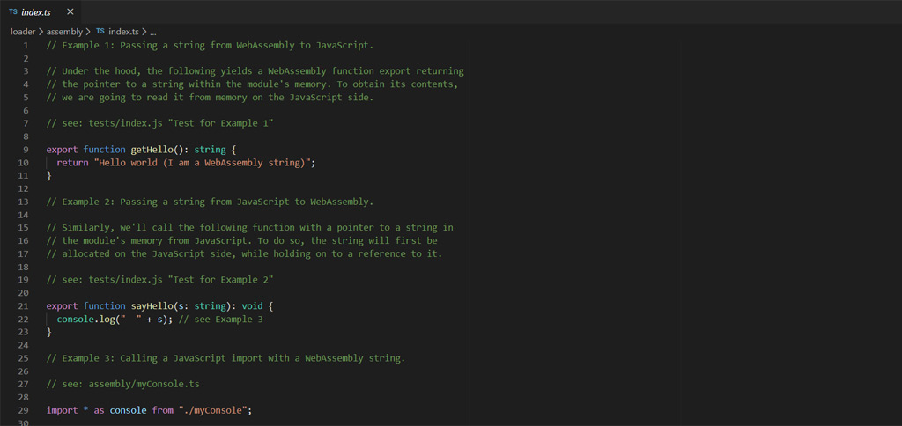
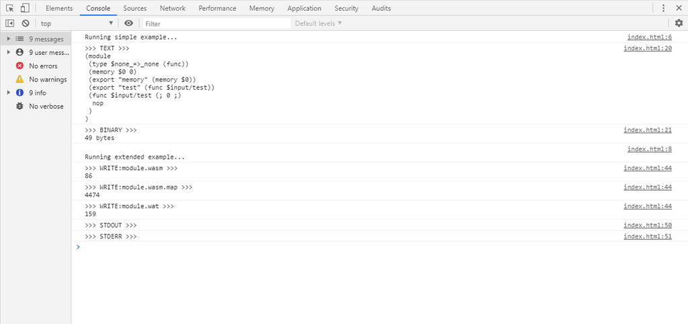

 AssemblyScript Examples
=======================

[](https://github.com/AssemblyScript/examples/actions)

## Instructions

This repository contains one example per directory. All examples can be obtained by cloning the repository:

```
$> git clone https://github.com/AssemblyScript/examples.git
$> cd examples
```

Afterwards, select the example you'd like to run and follow the instructions in its README file.

## Low-level perspective

The following examples make use of AssemblyScript's low-level capabilities, i.e. to essentially write WebAssembly with a nicer syntax.

* [Conway's Game Of Life](./game-of-life) ([demo](https://assemblyscript.github.io/examples/game-of-life/))<br />
  An implementation of the game of life with slight modifications. Updates an image buffer in memory, that is then presented on a canvas.

  

* [Mandelbrot Set](./mandelbrot) ([demo](https://assemblyscript.github.io/examples/mandelbrot/))<br />
  Computes 2048 offsets of a color gradient in memory, line by line, and presents the set using the gradient's actual colors, as computed on the JavaScript side, on a canvas.

  

* [Interference effect](./interference) ([demo](https://assemblyscript.github.io/examples/interference/))<br />
  Colin Eberhardt's and Ben Smith's WebAssembly interference effect, if it was written in AssemblyScript.

  

## High-level perspective

These examples cover slightly higher level aspects, like working with managed objects or interfacing with them.

* [N-body system](./n-body) ([demo](https://assemblyscript.github.io/examples/n-body/))<br />
  This is actually a benchmark - visualizing it just so happened.

  

* [Loader](./loader)<br />
  Utilizes the [loader](https://docs.assemblyscript.org/basics/loader) to perform various common tasks on the WebAssembly/JavaScript boundary, like passing along strings and arrays between both worlds.

  

## Libraries

Various WebAssembly or AssemblyScript features as a library.

* [i64](./i64)<br />
  Exposes WebAssembly's i64 operations to JavaScript using 32-bit integers (low and high bits).

* [libm](./libm)<br />
  Exposes AssemblyScript's math routines for double and single precision as a library.

## Features

General examples showing how to utilize specific AssemblyScript features.

* [Browser SDK](./sdk) ([demo](https://assemblyscript.github.io/examples/sdk/))<br />
  Shows how to use the browser SDK to run the AssemblyScript compiler in the browser.

  

* [Compiler transforms](./transform)<br />
  An example of using compiler transforms to hook into the compilation process.

## Additional resources

* [Wasm By Example](https://wasmbyexample.dev/all-examples-list.html)<br />
  A concise, hands-on introduction to WebAssembly using code snippets and annotated example programs. If you "learn best by doing", or just need a good starting point for a concept, this is the place for you.

* [Built with AssemblyScript](https://www.assemblyscript.org/built-with-assemblyscript.html)<br />
  A list of more sophisticated open source projects using AssemblyScript.
